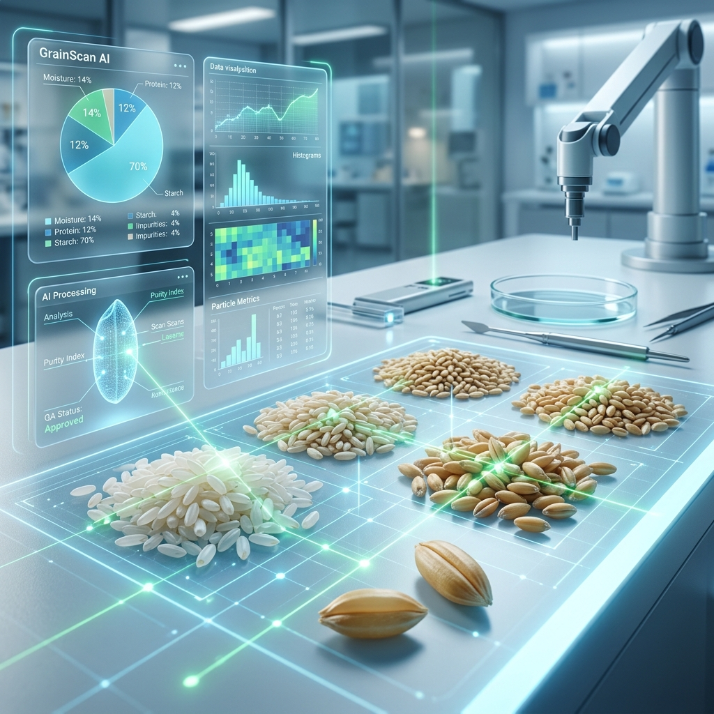
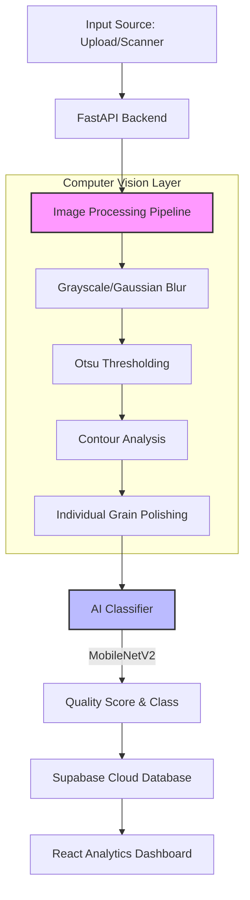

# 🌾 GrainScan AI — Intelligent Grain Quality Analysis



[](https://fastapi.tiangolo.com/)
[](https://reactjs.org/)
[](https://tailwindcss.com/)
[](https://supabase.io/)
[](https://opencv.org/)

**GrainScan AI** is a state-of-the-art laboratory tool designed for automated grain quality assessment. By combining Computer Vision (OpenCV) with Deep Learning, it provides instant, accurate analysis of rice and wheat samples, identifying defects like broken kernels, chalkiness, and discoloration.

---

## ✨ Key Features

- 🔍 **High-Precision Segmentation**: Uses Otsu's thresholding and contour detection to isolate individual grains from complex backgrounds.
- 🤖 **Dual-Mode AI Engine**: 
    - **Heuristic Mode**: Fast, lightweight analysis using color and shape geometry.
    - **Deep Learning Mode**: Integration with MobileNetV2 for clinical-grade accuracy.
- 📡 **Hardware Interoperability**:
    - **USB Scanner Support**: Folder-watch listener for direct scanner output.
    - **IOT/Network Integration**: REST endpoints for WiFi-enabled scanning devices.
- 📊 **Dynamic Dashboard**: Real-time visualization of quality distribution, grain counts, and annotated image overlays.
- 🔐 **Multi-User Management**: Role-based access control (Technician vs. Inspector) powered by Supabase.

---

## 🏗️ System Architecture



---

## 🚀 Getting Started

### 1. Database Setup (Supabase)
1. Create a project on [Supabase](https://supabase.com/).
2. Navigate to the **SQL Editor**.
3. Copy and run the contents of [supabase_setup.sql](./supabase_setup.sql).
4. Note your `SUPABASE_URL` and `SUPABASE_ANON_KEY`.

### 2. Backend Installation
```bash
git clone https://github.com/your-username/grainscan-ai.git
cd grain-analyzer/backend

# Create virtual environment
python -m venv venv
source venv/bin/activate  # Windows: venv\Scripts\activate

# Install dependencies
pip install -r requirements.txt

# Start API
uvicorn main:app --reload --port 8000
```
*API docs at: `http://localhost:8000/docs`*

### 3. Frontend Installation
```bash
cd ../frontend

# Install dependencies
npm install

# Setup Environment Variables
# Create a .env file with:
# VITE_SUPABASE_URL=your_url
# VITE_SUPABASE_ANON_KEY=your_key

npm run dev
```

---

## 📸 Screenshots

| Dashboard View | AI Analysis Preview |
|----------------|---------------------|
|  |  |

---

## 🛠️ Tech Stack

| Technology | Purpose |
| :--- | :--- |
| **Python / FastAPI** | High-performance asynchronous API |
| **OpenCV** | Image processing & segmentation |
| **PyTorch** | Deep learning model inference |
| **React / Vite** | Modern reactive UI |
| **Supabase** | Authentication & Database |
| **Tailwind CSS** | Styling & Design System |

---

## 💡 Hardware Recommendations

For optimal results, ensure your scanning environment follows these guidelines:
- **Contrast**: Use a matte white or black background to minimize shadows.
- **Density**: Grains should be spread out; touching grains may be counted as "clumped".
- **Lighting**: Use uniform, top-down lighting to avoid lateral highlights.

---

## 📄 License

Distributed under the MIT License. See `LICENSE` for more information.

---

<p align="center">
  Built with ❤️ for Agricultural Innovation
</p>
 **Background**: Use white or uniform light background
- **Lighting**: Diffuse, even lighting — avoid shadows
- **Arrangement**: Single layer of grains (no stacking/overlap)
- **Resolution**: Higher resolution → better segmentation
- **Distance**: Consistent camera/scanner height for size measurements
